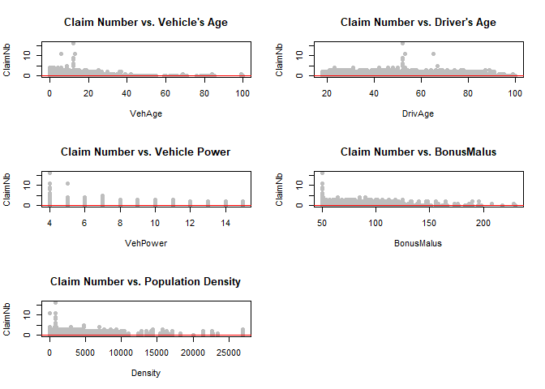
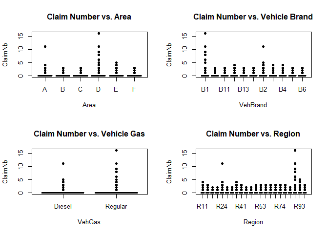
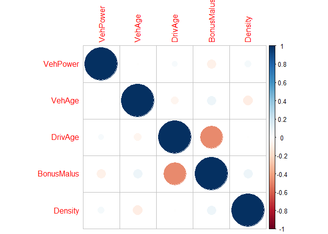
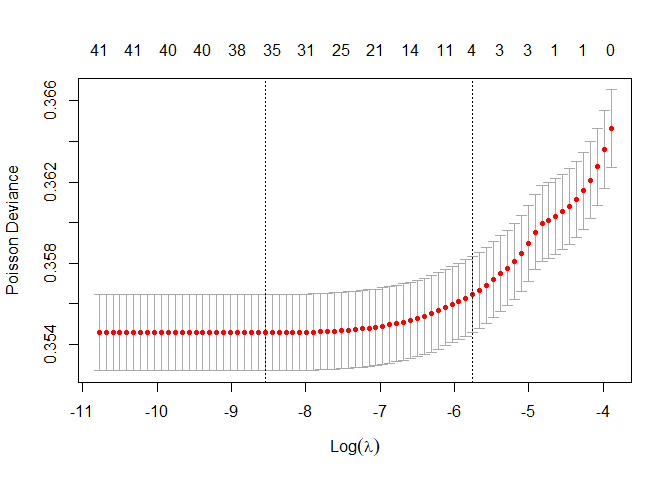
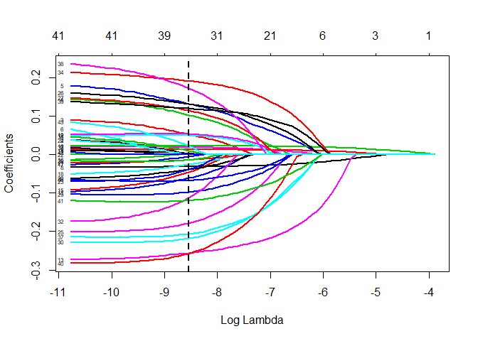
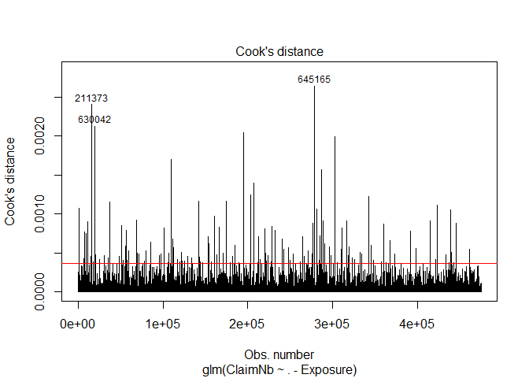
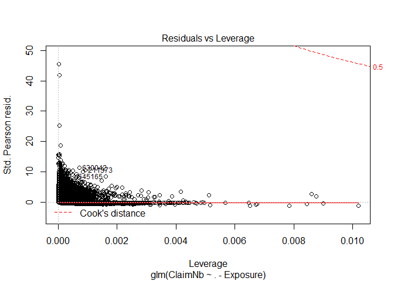
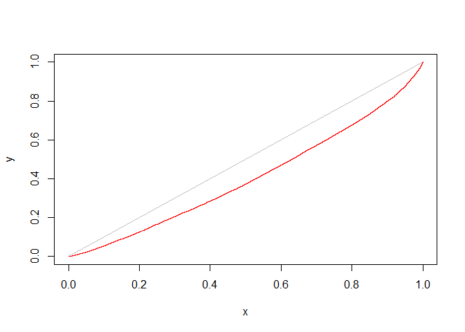

Special Topics in GLM
================

``` r
#install.packages("car")
library("car")
```

    ## Loading required package: carData

``` r
#install.packages("corrplot")
library(corrplot)
```

    ## corrplot 0.92 loaded

``` r
#install.packages("glmnet")
library(glmnet)
```

    ## Warning: package 'glmnet' was built under R version 3.6.3

    ## Loading required package: Matrix

    ## Warning: package 'Matrix' was built under R version 3.6.3

    ## Loaded glmnet 4.1-1

# Background

This is a demonstration used in my presentation at the ASM SOA Joint
Seminar. In this example, we want to predict the claim numbers of
different auto insurance policies and explain the driving forces.

# Exploratory Data Analysis

## Data Description

1.  **IDpol** The policy ID (used to link with the claims dataset
2.  **ClaimNb** Number of claims during the exposure period (numerical)
3.  **Exposure** The exposure period (numerical)
4.  **Area** The area code (factor)
5.  **VehPower** The power of the car (ordered categorical)
6.  **VehAge** The vehicle age, in years.
7.  **DrivAge** The driver age, in years (in France, people can drive a
    car at 18, numerical)
8.  **BonusMalus** Bonus/malus, between 50 and 350: &lt;100 means
    bonus, &gt;100 means malus in France(numerical)
9.  **VehBrand** The car brand (factor)
10. **VehGas** The car gas, Diesel or regular(factor)
11. **Density** The density of inhabitants (number of inhabitants per
    km2) in the city the driver of the car lives in,numerical)
12. **Region** The policy regions in France (based on a standard French
    classification,factor)

## Read the Data

``` r
# In R Studio, Session--> Set Working Directory --> Choose Directory(to the data source)
data = read.csv("freMTPL2freq.csv", header=TRUE)
# Remove 1st column
drops <- c("IDpol")
data <- data[ , !(names(data) %in% drops)]
head(data)
```

    ##   ClaimNb Exposure Area VehPower VehAge DrivAge BonusMalus VehBrand
    ## 1       1     0.10    D        5      0      55         50      B12
    ## 2       1     0.77    D        5      0      55         50      B12
    ## 3       1     0.75    B        6      2      52         50      B12
    ## 4       1     0.09    B        7      0      46         50      B12
    ## 5       1     0.84    B        7      0      46         50      B12
    ## 6       1     0.52    E        6      2      38         50      B12
    ##    VehGas Density Region
    ## 1 Regular    1217    R82
    ## 2 Regular    1217    R82
    ## 3  Diesel      54    R22
    ## 4  Diesel      76    R72
    ## 5  Diesel      76    R72
    ## 6 Regular    3003    R31

## Exploratory Data Analysis

### Numerical

``` r
# Reset
par(mfrow=c(1,1))

# Number of Plot 
par(mfrow=c(3,2))

# Plot claim number vs Vehicle's age
plot(ClaimNb~VehAge, data=data, main="Claim Number vs. Vehicle's Age", col="grey", pch = 16)
abline(lm(ClaimNb~VehAge, data=data), col="red")

# Plot claim number vs Driver's age
plot(ClaimNb~DrivAge, data=data, main="Claim Number vs. Driver's Age", col="grey", pch = 16)
abline(lm(ClaimNb~DrivAge, data=data), col="red")

# Plot claim number vs Vehicle Power
plot(ClaimNb~VehPower, data=data, main="Claim Number vs. Vehicle Power", col="grey", pch = 16)
abline(lm(ClaimNb~VehPower, data=data), col="red")

# Plot claim number vs BonusMalus
plot(ClaimNb~BonusMalus, data=data, main="Claim Number vs. BonusMalus", col="grey", pch = 16)
abline(lm(ClaimNb~BonusMalus, data=data), col="red")

# Plot claim number vs population density of the city
plot(ClaimNb~Density, data=data, main="Claim Number vs. Population Density", col="grey", pch = 16)
abline(lm(ClaimNb~Density, data=data), col="red")
```

<!-- -->
\#\#\# Categorical

``` r
# Reset
par(mfrow=c(1,1))
par(mfrow=c(2,2))

# Plot Claim Number vs Area
plot(ClaimNb~Area, data=data, main="Claim Number vs. Area", col="gray", pch = 16)
# Plot Claim Number vs Vehicle Brand
plot(ClaimNb~VehBrand, data=data, main="Claim Number vs. Vehicle Brand", col="gray", pch = 16)
# Plot Claim Number vs Vehicle Gas
plot(ClaimNb~VehGas, data=data, main="Claim Number vs. Vehicle Gas", col="gray",pch = 16)
# Plot Claim Number vs Region
plot(ClaimNb~Region, data=data, main="Claim Number vs. Region", col="gray",pch = 16)
```

<!-- -->

``` r
# Reset
par(mfrow=c(1,1))
```

### Correlation Between Predictors

We want to avoid including variables with strong correlations.

``` r
par(mfrow=c(1,1))
# Drop response, exposure and categorical variables 
drops <- c("Exposure","ClaimNb","Area", "VehBrand", "VehGas", "Region")
corrplot(cor(data[ , !(names(data) %in% drops)]))
```

<!-- -->

### Split Between Train and Test

``` r
## 70% of the sample size goes to training dataset
train_size <- floor(0.7 * nrow(data))

set.seed(1)
train_ind <- sample(seq_len(nrow(data)), size = train_size)

train <- data[train_ind, ]
test <- data[-train_ind, ]
head(train)
```

    ##        ClaimNb Exposure Area VehPower VehAge DrivAge BonusMalus VehBrand
    ## 548676       0     0.14    C        5      2      63         50       B2
    ## 452737       0     1.00    D        4      6      74         50       B1
    ## 124413       0     0.03    A       11     10      52         50       B1
    ## 436523       0     1.00    A        5      6      36         50       B5
    ## 666931       0     0.41    F        7      6      29         80       B1
    ## 25173        0     1.00    B        7      4      56         50       B5
    ##         VehGas Density Region
    ## 548676  Diesel     149    R24
    ## 452737 Regular    1759    R52
    ## 124413 Regular      28    R54
    ## 436523  Diesel      29    R24
    ## 666931 Regular   15725    R11
    ## 25173   Diesel      91    R24

# Model Developement

## GLM

``` r
#Exposure is not a predictor
model1 = glm(ClaimNb ~ . -Exposure, data=train, family= poisson(link = log), weights=Exposure)
summary(model1)
```

    ## 
    ## Call:
    ## glm(formula = ClaimNb ~ . - Exposure, family = poisson(link = log), 
    ##     data = train, weights = Exposure)
    ## 
    ## Deviance Residuals: 
    ##     Min       1Q   Median       3Q      Max  
    ## -1.7389  -0.3126  -0.2290  -0.1236   9.4804  
    ## 
    ## Coefficients:
    ##                 Estimate Std. Error z value Pr(>|z|)    
    ## (Intercept)   -4.748e+00  7.069e-02 -67.169  < 2e-16 ***
    ## AreaB          4.566e-02  3.153e-02   1.448 0.147565    
    ## AreaC          9.768e-02  2.615e-02   3.736 0.000187 ***
    ## AreaD          1.535e-01  2.856e-02   5.375 7.66e-08 ***
    ## AreaE          1.928e-01  3.918e-02   4.921 8.62e-07 ***
    ## AreaF          1.014e-01  1.438e-01   0.705 0.480740    
    ## VehPower       2.154e-02  4.245e-03   5.074 3.89e-07 ***
    ## VehAge        -3.256e-02  1.668e-03 -19.519  < 2e-16 ***
    ## DrivAge        1.327e-02  5.735e-04  23.133  < 2e-16 ***
    ## BonusMalus     2.264e-02  4.703e-04  48.131  < 2e-16 ***
    ## VehBrandB10   -1.021e-01  5.364e-02  -1.903 0.057039 .  
    ## VehBrandB11    4.833e-02  5.659e-02   0.854 0.393119    
    ## VehBrandB12   -2.751e-01  2.785e-02  -9.877  < 2e-16 ***
    ## VehBrandB13    9.336e-03  5.833e-02   0.160 0.872835    
    ## VehBrandB14   -9.775e-02  1.090e-01  -0.897 0.369640    
    ## VehBrandB2    -1.569e-02  2.148e-02  -0.730 0.465109    
    ## VehBrandB3    -2.949e-02  3.161e-02  -0.933 0.350770    
    ## VehBrandB4    -5.375e-02  4.300e-02  -1.250 0.211352    
    ## VehBrandB5     5.213e-02  3.538e-02   1.474 0.140582    
    ## VehBrandB6    -6.503e-02  4.114e-02  -1.581 0.113975    
    ## VehGasRegular -2.293e-02  1.631e-02  -1.406 0.159718    
    ## Density        4.756e-06  5.892e-06   0.807 0.419497    
    ## RegionR21     -6.263e-02  1.521e-01  -0.412 0.680505    
    ## RegionR22      5.236e-02  8.451e-02   0.620 0.535581    
    ## RegionR23     -1.934e-01  1.027e-01  -1.883 0.059707 .  
    ## RegionR24      1.758e-01  3.854e-02   4.561 5.09e-06 ***
    ## RegionR25      1.626e-01  6.509e-02   2.498 0.012503 *  
    ## RegionR26     -5.108e-03  7.750e-02  -0.066 0.947453    
    ## RegionR31     -9.406e-02  5.662e-02  -1.661 0.096690 .  
    ## RegionR41     -2.190e-01  7.023e-02  -3.118 0.001821 ** 
    ## RegionR42      1.240e-02  1.379e-01   0.090 0.928363    
    ## RegionR43     -1.713e-01  2.328e-01  -0.736 0.461829    
    ## RegionR52      3.114e-02  4.715e-02   0.660 0.508956    
    ## RegionR53      2.268e-01  4.382e-02   5.174 2.29e-07 ***
    ## RegionR54      6.116e-02  5.748e-02   1.064 0.287351    
    ## RegionR72     -5.510e-02  5.329e-02  -1.034 0.301213    
    ## RegionR73     -2.050e-01  7.331e-02  -2.797 0.005166 ** 
    ## RegionR74      2.552e-01  1.012e-01   2.523 0.011645 *  
    ## RegionR82      1.499e-01  3.859e-02   3.885 0.000102 ***
    ## RegionR83     -2.756e-01  1.245e-01  -2.214 0.026803 *  
    ## RegionR91     -1.101e-01  5.408e-02  -2.035 0.041851 *  
    ## RegionR93      1.722e-02  4.072e-02   0.423 0.672321    
    ## RegionR94      1.020e-01  1.151e-01   0.886 0.375540    
    ## ---
    ## Signif. codes:  0 '***' 0.001 '**' 0.01 '*' 0.05 '.' 0.1 ' ' 1
    ## 
    ## (Dispersion parameter for poisson family taken to be 1)
    ## 
    ##     Null deviance: 91431  on 474608  degrees of freedom
    ## Residual deviance: 88838  on 474566  degrees of freedom
    ## AIC: 119988
    ## 
    ## Number of Fisher Scoring iterations: 6

### GLM Goodness of Fit

For both tests, the p-value is 1, suggesting a good fit

``` r
# Deviance residuals test
cat("Deviance residuals test p-value:",
1-pchisq(model1$deviance, model1$df.residual), end="\n")
```

    ## Deviance residuals test p-value: 1

``` r
# Pearson residuals test
pResid <- resid(model1, type = "pearson")
cat("Pearson residuals test p-value:",
1-pchisq(sum(pResid^2), model1$df.residual))
```

    ## Pearson residuals test p-value: 1

### GLM Prediction

``` r
test$glm_pred = predict(model1, newdata = test, type="response")
```

\#\#LASSO

``` r
x = model.matrix(~.,data = subset(train, select=-c(ClaimNb,Exposure)))
set.seed(1874)
cv.lasso =cv.glmnet(x = x, 
                    y = train$ClaimNb,
                    weights = train$Exposure,
                    family = "poisson",
                    #LASSO
                    alpha = 1,
                    nfolds=20)

cat("CV Optimized lambda:\n")
```

    ## CV Optimized lambda:

``` r
cv.lasso$lambda.min
```

    ## [1] 0.0001945697

``` r
plot(cv.lasso)
```

<!-- -->
\#\#\#LASSO Coefficient Path

``` r
# Plot the regression coefficient path
mod_LASSO_path = glmnet(x = x, 
                        y = train$ClaimNb,
                        weights = train$Exposure,
                        family= "poisson",
                        alpha=1)
plot(mod_LASSO_path,xvar="lambda",label=TRUE,lwd=2)
abline(v=log(cv.lasso$lambda.min),col='black',lty = 2,lwd=2)
```

<!-- -->
\#\#\# LASSO Coefficient

``` r
coef(mod_LASSO_path, s=cv.lasso$lambda.min)
```

    ## 44 x 1 sparse Matrix of class "dgCMatrix"
    ##                           1
    ## (Intercept)   -4.659804e+00
    ## (Intercept)    .           
    ## AreaB          .           
    ## AreaC          5.186946e-02
    ## AreaD          1.020768e-01
    ## AreaE          1.317535e-01
    ## AreaF          .           
    ## VehPower       1.951238e-02
    ## VehAge        -3.150289e-02
    ## DrivAge        1.296105e-02
    ## BonusMalus     2.240306e-02
    ## VehBrandB10   -6.142289e-02
    ## VehBrandB11    4.981441e-02
    ## VehBrandB12   -2.562794e-01
    ## VehBrandB13    3.069606e-03
    ## VehBrandB14   -4.584011e-02
    ## VehBrandB2     .           
    ## VehBrandB3    -5.531240e-03
    ## VehBrandB4    -2.610339e-02
    ## VehBrandB5     5.346927e-02
    ## VehBrandB6    -3.814127e-02
    ## VehGasRegular -1.391539e-02
    ## Density        5.646443e-06
    ## RegionR21     -3.901756e-02
    ## RegionR22      .           
    ## RegionR23     -1.779513e-01
    ## RegionR24      1.323971e-01
    ## RegionR25      1.147635e-01
    ## RegionR26     -1.387566e-02
    ## RegionR31     -9.780308e-02
    ## RegionR41     -2.177639e-01
    ## RegionR42      .           
    ## RegionR43     -1.123184e-01
    ## RegionR52      .           
    ## RegionR53      1.916001e-01
    ## RegionR54      9.856313e-03
    ## RegionR72     -6.731981e-02
    ## RegionR73     -2.062430e-01
    ## RegionR74      1.728385e-01
    ## RegionR82      1.198057e-01
    ## RegionR83     -2.574909e-01
    ## RegionR91     -1.191859e-01
    ## RegionR93      .           
    ## RegionR94      2.207899e-02

\#\#\#Model Prediction

``` r
#Prepare test dataset, remember to remove the glm prediction
newx = model.matrix(~.,data = subset(test, select=-c(ClaimNb,Exposure,glm_pred )))
test$lasso_pred = predict(mod_LASSO_path, s = cv.lasso$lambda.min, newx = newx,type = 'response')
```

# Influential Point Diagnosis

## Identify Influential Points

``` r
# Outlier Test
outlierTest(model1)
```

    ##        rstudent unadjusted p-value Bonferroni p
    ## 6540   9.485047         2.4227e-21   1.1499e-15
    ## 321249 7.257547         3.9417e-13   1.8708e-07
    ## 46471  5.726374         1.0260e-08   4.8695e-03

``` r
# Count numer of coefficients p from glm
p = length(model1$coefficients)
n = nrow(train)
plot(model1, which = 4, id.n = 3)
abline(h = p/n *4, col="red")
```

<!-- -->
\#\# Residual and Leverage

``` r
plot(model1, which = 5)
```

<!-- -->

## Remove Influential Points

``` r
train_rem <- train[-c(211373, 645165, 630042), ]

model2 = glm(ClaimNb ~ . -Exposure, data=train_rem, family= poisson(link = log), weights=Exposure)
summary(model2)
```

    ## 
    ## Call:
    ## glm(formula = ClaimNb ~ . - Exposure, family = poisson(link = log), 
    ##     data = train_rem, weights = Exposure)
    ## 
    ## Deviance Residuals: 
    ##     Min       1Q   Median       3Q      Max  
    ## -1.7389  -0.3126  -0.2290  -0.1236   9.4804  
    ## 
    ## Coefficients:
    ##                 Estimate Std. Error z value Pr(>|z|)    
    ## (Intercept)   -4.748e+00  7.069e-02 -67.169  < 2e-16 ***
    ## AreaB          4.564e-02  3.153e-02   1.448 0.147686    
    ## AreaC          9.767e-02  2.615e-02   3.735 0.000188 ***
    ## AreaD          1.535e-01  2.856e-02   5.375 7.68e-08 ***
    ## AreaE          1.928e-01  3.918e-02   4.920 8.64e-07 ***
    ## AreaF          1.014e-01  1.438e-01   0.705 0.480823    
    ## VehPower       2.154e-02  4.245e-03   5.074 3.89e-07 ***
    ## VehAge        -3.256e-02  1.668e-03 -19.520  < 2e-16 ***
    ## DrivAge        1.327e-02  5.735e-04  23.132  < 2e-16 ***
    ## BonusMalus     2.264e-02  4.703e-04  48.131  < 2e-16 ***
    ## VehBrandB10   -1.021e-01  5.364e-02  -1.903 0.057043 .  
    ## VehBrandB11    4.833e-02  5.659e-02   0.854 0.393124    
    ## VehBrandB12   -2.751e-01  2.785e-02  -9.877  < 2e-16 ***
    ## VehBrandB13    9.336e-03  5.833e-02   0.160 0.872842    
    ## VehBrandB14   -9.775e-02  1.090e-01  -0.897 0.369642    
    ## VehBrandB2    -1.568e-02  2.148e-02  -0.730 0.465314    
    ## VehBrandB3    -2.949e-02  3.161e-02  -0.933 0.350773    
    ## VehBrandB4    -5.375e-02  4.300e-02  -1.250 0.211349    
    ## VehBrandB5     5.213e-02  3.538e-02   1.474 0.140578    
    ## VehBrandB6    -6.503e-02  4.114e-02  -1.581 0.113974    
    ## VehGasRegular -2.292e-02  1.631e-02  -1.406 0.159825    
    ## Density        4.757e-06  5.892e-06   0.807 0.419476    
    ## RegionR21     -6.264e-02  1.521e-01  -0.412 0.680490    
    ## RegionR22      5.236e-02  8.451e-02   0.619 0.535590    
    ## RegionR23     -1.934e-01  1.027e-01  -1.883 0.059705 .  
    ## RegionR24      1.758e-01  3.854e-02   4.561 5.10e-06 ***
    ## RegionR25      1.626e-01  6.509e-02   2.499 0.012456 *  
    ## RegionR26     -5.112e-03  7.750e-02  -0.066 0.947412    
    ## RegionR31     -9.406e-02  5.662e-02  -1.661 0.096689 .  
    ## RegionR41     -2.190e-01  7.023e-02  -3.118 0.001821 ** 
    ## RegionR42      1.240e-02  1.379e-01   0.090 0.928366    
    ## RegionR43     -1.713e-01  2.328e-01  -0.736 0.461820    
    ## RegionR52      3.114e-02  4.715e-02   0.660 0.508972    
    ## RegionR53      2.267e-01  4.382e-02   5.174 2.29e-07 ***
    ## RegionR54      6.116e-02  5.748e-02   1.064 0.287370    
    ## RegionR72     -5.510e-02  5.329e-02  -1.034 0.301197    
    ## RegionR73     -2.050e-01  7.331e-02  -2.797 0.005165 ** 
    ## RegionR74      2.552e-01  1.012e-01   2.523 0.011647 *  
    ## RegionR82      1.499e-01  3.859e-02   3.885 0.000102 ***
    ## RegionR83     -2.756e-01  1.245e-01  -2.214 0.026801 *  
    ## RegionR91     -1.101e-01  5.408e-02  -2.035 0.041849 *  
    ## RegionR93      1.722e-02  4.072e-02   0.423 0.672323    
    ## RegionR94      1.020e-01  1.151e-01   0.886 0.375557    
    ## ---
    ## Signif. codes:  0 '***' 0.001 '**' 0.01 '*' 0.05 '.' 0.1 ' ' 1
    ## 
    ## (Dispersion parameter for poisson family taken to be 1)
    ## 
    ##     Null deviance: 91431  on 474607  degrees of freedom
    ## Residual deviance: 88838  on 474565  degrees of freedom
    ## AIC: 119988
    ## 
    ## Number of Fisher Scoring iterations: 6

``` r
test$glm_pred_rem = predict(model2, newdata = test, type="response")
```

# Model Comparison

## Gini Index of plain GLM

``` r
#
# Gini index calculations
# code credit: "Predictive Modeling Applications in Actuarial Science", vol 2, chapter 1

# on testing data-GLM
o <- with(test, order(glm_pred))
x <- with(test, cumsum(Exposure[o])/sum(Exposure))
y <- with(test, cumsum(ClaimNb[o])/sum(ClaimNb))

dx <- x[-1] - x[-length(x)]
h <- (y[-1] + y[-length(y)])/2
gini <- 2 * (0.5 - sum(h * dx))

#op <- par(mar = c(5,4,0,0)+0.2)
plot(x = x, y = y, type = "n")
lines(x = c(0,1), y = c(0,1), col = "grey")
lines(x = x, y = y, col = "red")
```

<!-- -->

``` r
cat("Gini Index:", gini)
```

    ## Gini Index: 0.1906995

### Gini Index of LASSO

``` r
### Gini Index of LASSO 

#
# Gini index calculations
#

# on testing data-GLM
o <- with(test, order(lasso_pred))
x <- with(test, cumsum(Exposure[o])/sum(Exposure))
y <- with(test, cumsum(ClaimNb[o])/sum(ClaimNb))

dx <- x[-1] - x[-length(x)]
h <- (y[-1] + y[-length(y)])/2
gini <- 2 * (0.5 - sum(h * dx))

#op <- par(mar = c(5,4,0,0)+0.2)
plot(x = x, y = y, type = "n")
lines(x = c(0,1), y = c(0,1), col = "grey")
lines(x = x, y = y, col = "red")
```

<!-- -->

``` r
cat("Gini Index:", gini)
```

    ## Gini Index: 0.1923674

``` r
### Gini Index of GLM with influential points removed

#
# Gini index calculations
#

# on testing data-GLM with influential points removed
o <- with(test, order(glm_pred_rem))
x <- with(test, cumsum(Exposure[o])/sum(Exposure))
y <- with(test, cumsum(ClaimNb[o])/sum(ClaimNb))

dx <- x[-1] - x[-length(x)]
h <- (y[-1] + y[-length(y)])/2
gini <- 2 * (0.5 - sum(h * dx))

#op <- par(mar = c(5,4,0,0)+0.2)
plot(x = x, y = y, type = "n")
lines(x = c(0,1), y = c(0,1), col = "grey")
lines(x = x, y = y, col = "red")
```

<!-- -->

``` r
cat("Gini Index:", gini)
```

    ## Gini Index: 0.1906998
